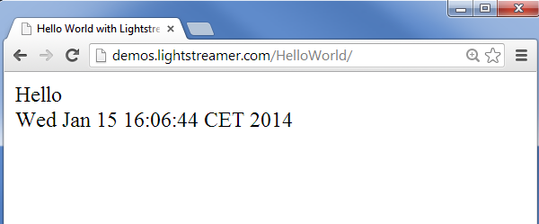

# Lightstreamer - "Hello World" Tutorial - HTML Client 
<!-- START DESCRIPTION lightstreamer-example-helloworld-client-javascript -->
The demos of the "Hello World with Lightstreamer" series are very basic examples where we push the alternated strings "Hello" and "World", followed by the current timestamp, from the server to the browser.

This project includes a web client front-end for the "Hello World" Tutorial: a simple HTML page that displays the real-time data pushed by the Server

As an example of [Lightstreamer Adapters Needed by This Client](https://github.com/Weswit/Lightstreamer-example-HelloWorld-client-javascript#lightstreamer-adapters-needed-by-this-client), you may refer to the [Lightstreamer - "Hello World" Tutorial - Java Adapter](https://github.com/Weswit/Lightstreamer-example-HelloWorld-adapter-java).

## Live Demo

[](http://demos.lightstreamer.com/HelloWorld)

###[ View live demo](http://demos.lightstreamer.com/HelloWorld)


## Details
Lightstreamer is made up of a Server and a set of Client libraries. Lightstreamer's job is to push real-time data over the Web in both directions (from the server to the clients and from the clients to the server). To do that, it uses a set of techniques refined and tuned over the last 13 years, including HTTP Streaming, Comet, and WebSockets.

Let's see how to build a "Hello World" application with Lightstreamer. The client will be based on <b>HTML</b> and <b>JavaScript</b>, while the server-side Data Adapter will be based on <b>Java</b>, but examples in <b>.NET</b> and in plain <b>TCP sockets</b> are also published.<br>

Let's keep the "Hello World" demo very basic: we want to push the alternated strings "Hello" and "World", followed by the current timestamp, from the server to the browser. 
The demo is based on two components: the HTML front-end, on the client side, and the Data Adapter, on the server side.
This project focuses on the client, we will use the new JavaScript Client lib version 6, introduced with Lightstreamer Colosseo. We will start from scratch and with zero knowledge of the framework, introducing some terms and concepts while explaining the code.

### Data Model

In the Lightstreamer framework, you subscribe to *Items*. An item is made up of a number of fields whose values change over time. Here are some examples of possible items:

* An item in Lightstreamer could represent an item on <b>eBay</b>, say, a pair of "Nike Air Jordan" shoes. The <b>Item name</b> would be "NIKE-AIR-JORDAN-XX3-XXIII-23-PREMIER-Limited-sz-10". Some fields would be: <i>current_bid, total_bids,</i> and <i>high_bidder</i>. When a field changes, the new value is pushed to the browser and displayed in real-time.
* An item could represent a <b>weather probe</b>. The Item name would be, for example, "Mt_Everest_Probe.1" ([this probe was left by MIT](http://web.media.mit.edu/%7Efletcher/argos/weather-probes.html) after the 1998 Everest Expedition). Some fields would be: <i>temperature, barometric_pressure,</i> and <i>light_level</i>.
* In <b>finance market data dissemination</b>, an item often represents a stock quote. The item name would be, for example, "TIBX.O" (TIBCO Software Inc. on Nasdaq). Some fields would be: <i>TRDPRC_1, TRDTIM_1, BID,</i> and <i>ASK</i>.

That said, how can we represent our very complex <b>Hello World</b> messages? Of course, through an item... The item name will be `greetings`. It will have two fields: `message` and `timestamp`.
<!-- END DESCRIPTION lightstreamer-example-helloworld-client-javascript -->

### Dig the Code

We should include a couple of libraries; we need an <b>AMD loader</b> as the Lightstreamer JavaScript Client library is splitted in several modules. We'll use [RequireJS](http://requirejs.org/) as our AMD loader. We don't even need to download it, let's link it from [cdnjs](http://www.cdnjs.com/):

```html
<script language="JavaScript" src ="http://cdnjs.cloudflare.com/ajax/libs/require.js/1.0.7/require.min.js"></script>
```

Obviously, we also need to include the Lightstreamer library (which you can find in the "Lightstreamer/DOCS-SDKs/sdk_client_javascript/lib" folder of your Lightstreamer installation):

```html
<script language="JavaScript" src ="lightstreamer.js"></script>
```

By the way, for the sake of simplicity, we include the full library, but you can generate a customized lightstreamer.js library containing only the classes you actually use. The generator is simply an HTML page available in the "Lightstreamer/DOCS-SDKs/sdk_client_javascript/tools" folder.

Then, we can create two div elements that will host the pushed fields:

```html
<div data-source="lightstreamer" data-grid="hellogrid" data-item="greetings" data-field="message">loading...</div>
<div data-source="lightstreamer" data-grid="hellogrid" data-item="greetings" data-field="timestamp">loading...</div>
```

The <b>data-source</b>=<b>"lightstreamer"</b> property binds a div element to Lightstreamer. The <b>data-item</b> and <b>data-field</b> properties identify the data to be displayed in the div element. The initial value displayed on the page will be "loading...", which will be replaced by the real-time data after the subscription has been done.

Finally, let's add some JavaScript code to tie things together:

```html
<script>
  require(["LightstreamerClient", "Subscription", "StaticGrid"], function(LightstreamerClient, Subscription, StaticGrid) {
    var client = new LightstreamerClient(null, "HELLOWORLD");
    client.connect();
    
    var grid = new StaticGrid("hellogrid", true);
    
    var subscription = new Subscription("MERGE", grid.extractItemList(), grid.extractFieldList());
    subscription.addListener(grid);
    
    client.subscribe(subscription);
  });      
</script>  
```

Confused by the code above? Let's explain it a little bit.

We call RequireJS's <b>require</b> method to load the classes we need for our application. As soon as the classes are ready, require will call our callback, giving us pointers to the mentioned classes. In this case, we ask for:

* <b>LightstreamerClient</b>, which will handle the connections to the server.
* <b>Subscription</b>, which represents our subscription and will be used to subscribe the HELLOWORLD item on the server, as well as to receive updates.
* <b>StaticGrid</b>, which represents a grid of HTML elements statically defined on the page (i.e., our two div elements). The static grid can be configured as a listener for the Subscription instances to automatically show the updates on the page.

The code above creates a LightstreamerClient instance specifying two parameters; the first is the server address. We may specify the address of our Lightstreamer server there (like "http://push.lightstreamer.com") or we can set it to null. In the latter case, the LightstreamerClient will assume that the Lightstreamer Server address is the same as the Web Server address from which the page was downloaded (i.e., it expects to be loaded from Lightstreamer's internal web server).

Once the LightstreamerClient is configured, it can be connected to the Lightstreamer server through a <b>connect</b> call.

Then, we configure the <b>StaticGrid</b> instance. With the first parameter, we bind all the HTML elements that contain the the <b>data-grid</b>=<b>"hellogrid"</b> property to the logical grid. With the second parameter (true), we ask the grid to immediately parse the HTML code searching for such elements.

We can now configure the <b>Subscription</b> specifying the Subscription Mode to be used, MERGE in this case, and then we specify the list of items and the list of fields to be subscribed to. We're lazy, so we extract such lists from the HTML elements bound to our StaticGrid.

Finally, we put things together: we make the StaticGrid a <b>listener</b> of our Subscription and then we pass the Subscription to our <b>LightstreamerClient</b> so that it can actually do the subscription on the Lightstreamer Server.

The full source code of the resulting page is shown in the src/index.html file of this project. 

Would you like to add a connection status indicator in your page? Lightstreamer provides one out of the box. Just add this line of code before client.connect():

```js
client.addListener(new StatusWidget("left", "50%"))
```

Well, you are using one more class, so you should add it to the require method:

```js
require(["LightstreamerClient", "StatusWidget", "Subscription", "StaticGrid"], function(LightstreamerClient, StatusWidget, Subscription, StaticGrid) {
```

This example is really very basic and exploits only a minor portion of the features offered by the Lightstreamer API. To delve a bit more into the API used above, you can take a look at the online API references: [JavaScript Client API Reference](http://www.lightstreamer.com/docs/client_javascript_uni_api/index.html).

But first, you should read the JavaScript Client Guide, available in the "/Lightstreamer/DOCS-SDKs/sdk_client_javascript/doc" folder of your Lightstreamer installation.


## Install
If you want to install a version of this demo pointing to your local Lightstreamer Server, follow these steps:
* As prerequisite, the [Lightstreamer - "Hello World" Tutorial - Java Adapter](https://github.com/Weswit/Lightstreamer-example-HelloWorld-adapter-java) has to be deployed on your local Lightstreamer Server instance. Please check out that project and follow the installation instructions provided with it.
* Download this project.
* Get the `lightstreamer.js` file from the [latest Lightstreamer distribution](http://www.lightstreamer.com/download) located in `<LS_HOME>/DOCS-SDKs/sdk_client_javascript/lib` and put it in the `src` folder.
* Deploy this demo on the Lightstreamer Server used as Web server: create the folders `<LS_HOME>/pages/HelloWorld` and copy here the contents of the `/src` folder of this project. *Note. If we use the Lightstreamer Server as a Web server, both the static resources and the real-time data will be delivered by the Lightstreamer Server. But the typical production architecture has an external Web server (whatever it is), in addition to the Lightstreamer Server. Everything is downloaded from the Web server except for the real-time data, which comes from the Lightstreamer Server. This separation improves both flexibility (you are free to use whatever Web/application server you want) and performance (you can isolate the power-demanding real-time connections to a separate box, without impacting your existing Web infrastructure).* 
* The client demo configuration assumes that Lightstreamer Server, Lightstreamer Adapters, and this client are launched on the same machine. If you need to target a different Lightstreamer server, please search in `index.html` this line:<BR/> `var client = new LightstreamerClient(null,"HELLOWORLD");`<BR/> and change it accordingly.
* Open your browser and point it to: [http://localhost:8080/HelloWorld/](http://localhost:8080/HelloWorld/)

## See Also

### Lightstreamer Adapters Needed by This Client
<!-- START RELATED_ENTRIES -->

* [Lightstreamer - "Hello World" Tutorial - Java Adapter](https://github.com/Weswit/Lightstreamer-example-HelloWorld-adapter-java)
 
### Related Projects

* [Lightstreamer - "Hello World" Tutorial - .NET Adapter](https://github.com/Weswit/Lightstreamer-example-HelloWorld-adapter-dotnet)
* [Lightstreamer - "Hello World" Tutorial - TCP Socket Adapter](https://github.com/Weswit/Lightstreamer-example-HelloWorld-adapter-socket)
* [Lightstreamer - "Hello World" Tutorial - Node.js Adapter](https://github.com/Weswit/Lightstreamer-example-HelloWorld-adapter-node)
* [Lightstreamer - "Hello World" Tutorial - Java SE (AMF) Adapter](https://github.com/Weswit/Lightstreamer-example-AMFHelloWorld-adapter-java)
* [Lightstreamer - "Hello World" Tutorial - Flex (AMF) Client](https://github.com/Weswit/Lightstreamer-example-AMFHelloWorld-client-flex)
 
<!-- END RELATED_ENTRIES -->

## Lightstreamer Compatibility Notes

- Compatible with Lightstreamer JavaScript Client Library version 6.0 or newer.

## Final Notes
For more information, please [visit our website](http://www.lightstreamer.com/) and [post to our support forums](http://forums.lightstreamer.com) any feedback or questions you might have. Thanks!
